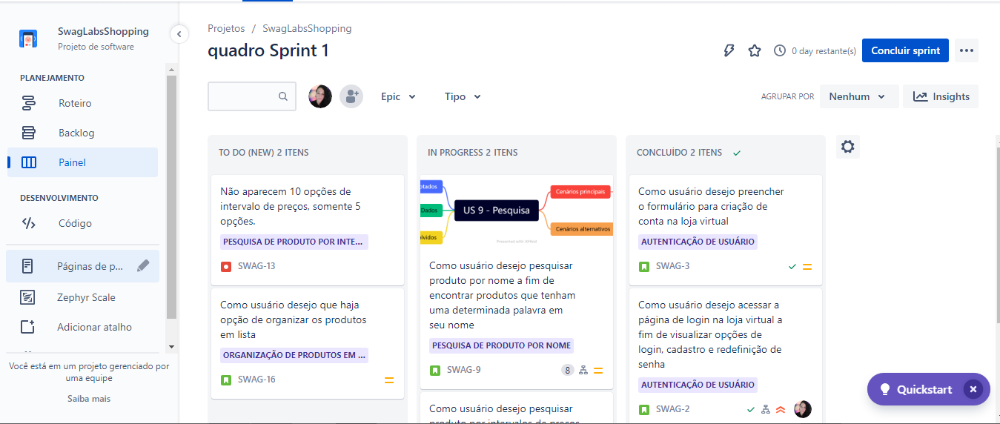

# DIO | GFT Quality Assurance

 
 > Criando fluxos de trabalho, user history, casos de testes e mind map.

 Desafio realizado para o Bootcamp **GFT Quality Assurance** da **DIO**.

## 🔧 Ferramentas e Tecnologias

- Jira 
- Zephyr
- BDD (Behavior Driven Development) 
- Miro (Mind Map)

## 🔗 Contato

mykallella@gmail.com
